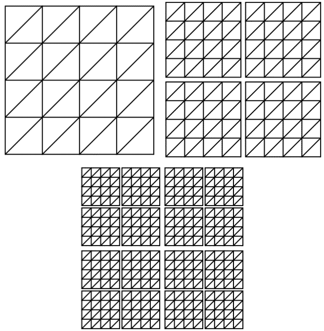

# SoTerrain

## Algorithm Description

### Chunked LoD algorithm

### Motivation

Since 2001, Ulrich Thatcher has been developing his own alternative to well-known terrain LoD algorithms such as
e.g., ROAM [2], SOAR [3] and Geo Mip-Mapping [4] called Chunked LoD [1].
The main principle of this algorithm is the representation of the displayed terrain as a quadrant tree
tiles at different levels of detail and selecting the displayed tiles according to the current camera position
given the terrain. Tiles are organized hierarchically in a tree with the root of the tree being the tile
covering the entire displayed terrain with the lowest level of detail, and it is then recursively divided into four
tiles with double the level of detail. The first three levels of such a tree are shown in Figure 1.

* Figure 1. The first three levels of the quadrant tree paver. 

Since when replacing a parent tile with four children during the algorithm's run, k occurs
to a relatively sudden change in triangulation geometry, it is necessary to smoothly adapt the geometry of tiles with a higher level
tile geometry details with a lower level of detail. In English terminology, this technology is called geo-
morphing and in our case it can be achieved by interpolating the height of the points on even rows and columns of the tile
with the average height of points on odd rows or columns of the tile. Assuming a display error
of the parent tile is twice the display error of the child tiles, we can easily calculate by
of the relevant formulas given in [1] factor for this interpolation. In practice, this means that immediately after the change
a tile with a lower level of detail behind a tile with a higher level of detail has a factor of 0 and its geometry is similar
original tile. As the camera moves closer to a tile, the geometry gradually changes to that of that tile.
When the factor reaches a value of 1, the tile already has its geometry completely.

### Implementation

This project is part of the SoTerrain library [5], which is an extension of the Coin library [6] with a set of nodes
scene graph implementing terrain visualization algorithms and which was the main part of my bachelor's thesis.
In framework this project were implemented classes SoSimpleChunkedLoDTerrain,
SbChunkedLoDTileTree and SbChunkedLoDTile and changed the build system from an ordinary Makefile to the GNU Automake system [7].
The SoSimpleChunkedLoDTerrain scene plot node is used by pre-ordering the class nodes
SoCoordinate3, SoTexture2, SoTextureCoordinate2, SoNormal and SoNormalBinding containing
coordinates of displayed height map points, texture, texture coordinates, normals and method of use
normal The terrain node then obtains information from these nodes using elements in the first frame and creates it
a quadrant tree of tiles. Because the current implementation uses regular tiling on
triangles (such as in Figure 1) instead of the adaptive division presented in the document [1], is somewhat
more difficult to achieve the rule that the display error of the parent tile is twice the display error
descendant tiles, and the subsequent calculation of the interpolation factor is also more complicated. This is handled by cropping
of the resulting factor to the range <0, 1>. If the factor is equal to 1, interpolation is not applied at all, and rendering
the function is replaced by a more optimal one. Further, to use this feature more often is a factor even before cropping
multiplied by a constant of 2 to reach the final tile geometry sooner.
If enabled, tiles are also trimmed by the viewport. This means that if the cuboid
bounding each tile is off-screen, the tile is excluded from rendering before its own
triangles sent to the graphics card. This greatly affects the overall performance of the algorithm.
Next, there are three images demonstrating the progress of the algorithm, the first two showing the rendered terrain
by the Chunked LoD algorithm with full triangles or as a wireframe, the last picture shows the consequence
cropping with a viewing body.

### Using the test application

A simple application was created to demonstrate the implemented algorithms of the SoTerrain library
SoTerrainTest, which can be compiled with the make command in the main directory. However, it needs to be configured first
library using the ./autogen.sh and ./configure scripts. With this configuration, you can specify whether it should be
library translated with debugging or profiling information or with a custom profiling library.
A list of these and other options, including help, can be displayed with the command ./configure –-help. Description,
how to translate and run the project on the merlin.fit.vutbr.cz computer is in the README file.
The parameters and usage of the test application is as follows:
Use:

### Used sources

[1] Urlich, Thatcher. Rendering Massive Terrains using Chunked Level of Detail Control. Odd world
Inhabitants, 2002. 14 pages. Available from: 
http://cvs.sourceforge.net/cgi-bin/viewcvs.cgi/*checkout*/tu-testbed/tu-testbed/docs/sig-notes.pdf?rev=HEAD

[2] DUCHAINEAU, Mark A., WOLINKSY, Murray, SIGETI, David E. MILLER, Mark C., ALDRICH, Charles and
MINEEV-WEINSTEIN, Mark B. ROAMing terrain: Real–time optimally adapting meshes. IEEE
Visualization ’97. 1997, pages 81-88. Available from: http://www.llnl.gov/graphics/ROAM/roam.pdf

[3] LINDSTROM Peter and PASCUCCI, Valerio. Terrain Simplification Simplified: A General Framework for
View-Dependent Out–of–Core Visualization. IEEE Transactions on
Visualization and Computer Graphics. 2002, year 8, No. 3, pages 239–254. Available from:
http://www.pascucci.org/pdf-papers/IEEE-TVG-2002.pdf

[4] DE BOER, Willem H. Fast Terrain Rendering Using Geometrical MipMapping. 2000. 7 pages. Available from:
http://www.flipcode.com/articles/article_geomipmaps.pdf

[5] SoTerrain terrain visualization algorithm library: http://blackhex.no-ip.org/wiki/SoTerrain

[6] Coin library, OpenInventor library implementation: http://coin3d.org

[7] The GNU Automake system: http://sources.redhat.com/automake/

## Example code

Try with following options:

    SoTerrain -a roam -v -h heightmaps/ps_height_1k.png -t images/textures/ps_texture_1k.jpg